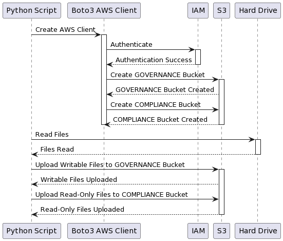

# Create S3 Buckets with Object Locks

Scripts to create 2 S3 buckets in AWS, one with a governance mode object lock and the other with a compliance mode object lock, and then upload files from a given directory to the appropriate bucket based on local file permissions: read-only files go to compliance bucket, others to governance bucket.

Parameters:

Access Key Id

Secret Access Key

Session Key (set to "None" if using permanent credentials)

## Boto3

A python script.

In the config.json replace MY_BUCKET_BASE_NAME with your preferred prefix.

